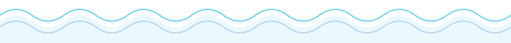
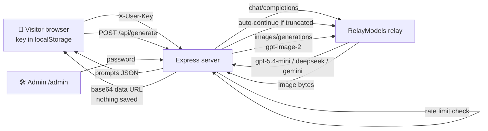

<div align="center">



[](https://nodejs.org)
[](https://expressjs.com)
[](./LICENSE)
[](./public/app.js)
[](#-privacy--zero-server-storage)
[](https://github.com/mymyanmarland/ocean-canvas/pulls)

**စိတ်ကူးသမုဒ္ဒရာ** — *an ocean of imagination.*

Turn a rough idea into a polished English image prompt, then turn that prompt into
stunning AI imagery — all in one immersive underwater studio. No accounts, no uploads,
nothing ever stored on the server.

[✨ Features](#-features) · [🎬 Preview](#-preview) · [🚀 Quick start](#-quick-start) ·
[🔌 API](#-api) · [🔒 Privacy](#-privacy--zero-server-storage)

</div>



## ✨ Features

<div align="center">

| | |
|---|---|
|  | **✨ Prompt Studio** — Describe your idea in Burmese or English and get a polished, vivid image prompt back. **13 categories** (photo, art, anime, landscape, portrait, product, fantasy, architecture, food, game, logo, poster, icon), **LLM model picker**, 3 prompt lengths, up to **3 variants** per idea, output in **English or Burmese**. If the model gets cut off mid-sentence, the server **auto-continues** it — prompts always arrive complete. |
|  | **🖼️ Image generation** — One click sends your prompt to `gpt-image-2` (via RelayModels). Portrait / square / landscape sizes, sequential multi-image runs, and the result streams back as a **base64 data URL straight into your browser** — download it instantly. |
|  | **🔑 Bring your own API key** — Every visitor uses their *own* RelayModels key. It lives only in the browser's `localStorage`, is sent per-request as `X-User-Key`, and is **never written to disk**. Missing key → friendly modal; rejected key → clear error with a re-enter prompt. |
|  | **🛡️ Zero server storage** — Generated images are **never saved** on the server: no files, no database rows, no gallery. The gallery endpoint returns `[]` by design. Your creations exist only in your browser tab. |

</div>

Plus the little things that make it feel alive:

- 🌊 **Soothing water sound** — a WebAudio-synthesized ocean wash (no audio files) fades in while anything loads and fades out when it finishes. `🔊/🔇` toggle in the header, preference remembered.
- 🫧 **Ambient ocean scenes** — on wide screens the side margins come alive: a glowing jellyfish with waving tentacles on the left, a drifting school of fish on the right, rising bubbles and twinkling sparkles everywhere. Pure inline SVG + CSS, zero dependencies, respects `prefers-reduced-motion`.
- 💎 **Glossy 3D UI** — neumorphic prompt boxes with aqua focus glow, glossy pill buttons and tabs with traveling light streaks.
- ⏳ **Pretty loaders** — gradient ring loaders with orbiting gold dots, bouncing dots, and sliding ocean waves.
- 🌐 **Bilingual** — full Myanmar / English UI with one-tap toggle.
- 🛠️ **Admin panel** (`/admin`) — relay configuration, encrypted key storage, connection tests, usage stats.


## 🎬 Preview

<div align="center">

<br/>
<em>Stylized mockup — the real thing is even prettier. 🌊</em>
</div>

## 🚀 Quick start

```bash
# 1. Clone
git clone https://github.com/mymyanmarland/ocean-canvas.git
cd ocean-canvas

# 2. Install (only dependency: express)
npm install

# 3. Configure
export APP_SECRET="a-long-random-string"   # encrypts stored relay keys
export ADMIN_PASSWORD="choose-a-strong-one" # enables /admin (optional)
# export PORT=3016                          # default 3016

# 4. Dive in
node server.js
# → http://localhost:3016
```

Then open the app, paste your **RelayModels API key** when the modal appears, and start creating.
Get a key at [relaymodels.com](https://api.relaymodels.com).

> 🐳 **Deploy anywhere** — it's a single stateless Node process. PM2, systemd,
> Docker, Render, or a plain VPS behind nginx all work. The SQLite database only
> holds encrypted relay keys and rate-limit-friendly metadata.

## ⚙️ Configuration

| Variable | Default | Description |
|---|---|---|
| `PORT` | `3016` | HTTP port |
| `APP_SECRET` | `"dev"` | AES-256-GCM key for encrypted relay keys — **set this in production** |
| `ADMIN_PASSWORD` | *(unset)* | Enables `/admin`; unset = admin disabled |
| `PROMPT_LLM` | `gpt-5.4-mini` | Default prompt-generation model |
| `RATE_LIMIT_PER_HOUR` | `30` | Image generations per IP per hour |
| `IMAGE_DAILY_LIMIT` | `20` | Image generations per IP per day |
| `PROMPT_RATE_LIMIT_PER_HOUR` | `30` | Prompt generations per IP per hour |
| `EXTRA_APPROVED_RELAYS` | *(unset)* | Comma-separated extra relay base URLs |

## 🔌 API

All JSON. Prompt/image endpoints require the visitor's key via the `X-User-Key` header
(`401 NO_USER_KEY` / `INVALID_KEY` otherwise).

| Method & path | Description |
|---|---|
| `POST /api/prompt-gen` | `{ idea, category, model, length, variants, lang }` → `{ prompts[] }` |
| `POST /api/generate` | `{ prompt, size }` → `{ image: "data:image/…;base64,…" }` |
| `GET /api/cats` | 13 prompt categories with guidance |
| `GET /api/models` | Chat models available for prompt generation |
| `GET /api/gallery` | Always `{ images: [] }` — nothing is stored, by design |
| `GET /api/status` | Public status (key configured? admin enabled?) |

<details>
<summary>🏗️ How a request flows</summary>



</details>

## 🗂️ Project structure

```
ocean-canvas/
├── server.js          # Express app: API, relays, rate limits, admin, zero-storage pipeline
├── src/
│   └── store.js       # SQLite (encrypted relay keys only — no images, ever)
├── public/
│   ├── index.html     # Image Studio + Prompt Studio UI
│   ├── app.js         # Frontend: tabs, loaders, water sound, BYO key flow
│   ├── style.css      # Abyssal theme, glossy 3D, ocean ambience, animations
│   ├── admin.html / admin.js  # Admin panel
│   └── favicon.svg
├── assets/            # Animated SVG art for this README
├── LICENSE            # MIT
└── package.json
```

## 🔒 Privacy — zero server storage

This is a deliberate design decision, not a missing feature:

- `POST /api/generate` converts the relay's image bytes to a base64 data URL **in memory**
  and returns it. No file is written. No database row is created.
- There is no gallery, no history, no uploads folder on the server.
- Your RelayModels key never leaves your browser except inside the API request itself.

*Your imagination passes through — it never stays.*


## 📜 License

MIT © 2026 [808 Coder](./LICENSE) — dive in, fork it, make it yours. 🌊

<div align="center">

*Crafted with 💙 somewhere under the sea.*

</div>
